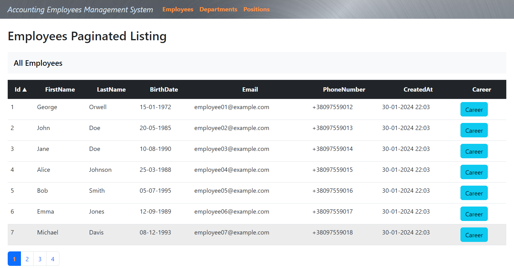
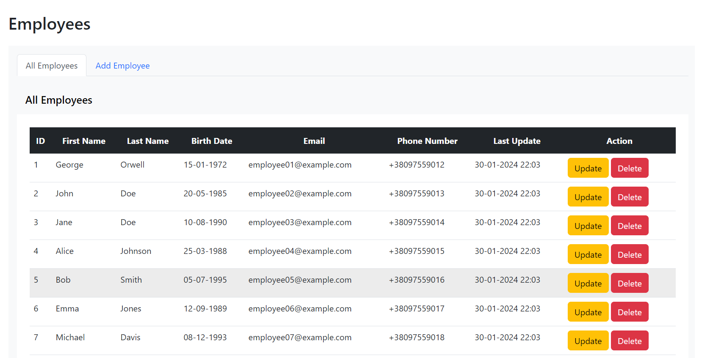
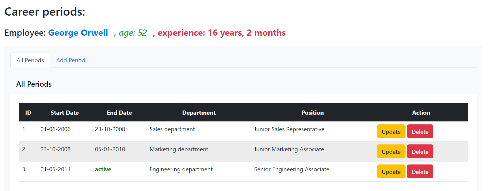
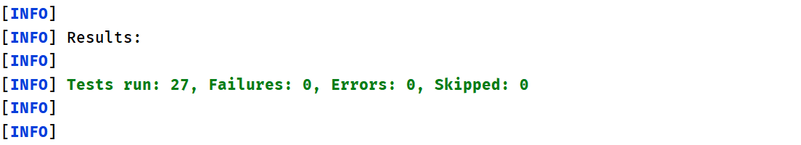

# AccountingEmployeesProject
___

## Огляд проєкту

Проєкт **"AccountingEmployeesProject"** є вебдодатком на базі Spring Boot, який реалізує механізм ведення обліку працівників та забезпечує базовий функціонал через REST API. Взаємодія відбувається через HTTP-запити: GET (отримання ресурсу), POST (створення ресурсу), PUT (оновлення ресурсу), DELETE (видалення ресурсу). Обмін даними відбувається у форматі JSON для ефективної комунікації між клієнтом та REST вебсервісами. Також в проєкті реалізовано тестування для перевірки функціонала (**Всього: 27 тестів**).

Для перегляду роботи проєкту запустіть його в локальному середовищі та відкрийте посилання у браузері: http://localhost:8080.
___

___

### Структура проєкту

Проєкт організований у різні пакети та класи для полегшення розуміння та підтримки коду.
REST вебсервіс на Java реалізовано за архітектурним шаблоном MVC.

#### 1. model:
- Клас **Employee** містить основні характеристики: ім'я, прізвище, дата народження, електронна пошта, номер телефону.
- Анотація **@JsonIgnore** використовується для уникнення циклічної серіалізації при виведенні списку періодів (periods), які пов'язані з працівником.
- Клас **Department** містить назви департаментів з унікальним ідентифікатором та назвою.
- Клас **Position** містить назви посад з унікальним ідентифікатором та назвою.
- Клас **Period** містить дані періодів роботи працівника в його кар'єрі, що включає дати початку та закінчення роботи, а також зв'язки з департаментом, посадою та працівником.
- Анотація **@ManyToOn** та **@JoinColumn** використовується для встановлення зв'язків з департаментом (departmentId), посадою (positionId) та працівником (employeeId).
- Анотація **@JsonBackReference** використовується для уникнення циклічної серіалізації при виведенні працівника з його періодами.

#### 2. repository:
- Пакет repository відповідає за взаємодію з базою даних через **JPA**.
- У ньому розташовані відповідні для кожного класу **query** для взаємодії з моделями даних.
- Кожен репозиторій включає методи для виконання операцій з базою даних, специфічних для відповідного класу моделі.

#### 3. service:
- Пакет service відповідає за бізнес-логіку та забезпечує виконання операцій з даними в рамках проєкту. Містить інтерфейси та реалізації сервісів, що надають функціональність для керування працівниками, періодами роботи, департаментами та посадами.
- Основні класи сервісів включають **EmployeeServiceImpl, PeriodServiceImpl, DepartmentServiceImpl, PositionServiceImpl та PagingServiceImpl**.
- Кожен з них реалізує відповідний функціонал, такий як керування персоналом, періодами кар'єри, департаментами та посадами, а також реалізацію сторінкованого доступу до списків працівників.
- Методи **getEmployeeByDepartment, getEmployeeByPosition, getEmployeesByAgeRange, findEmployeesOlderThan, findEmployeesYoungerThan, getAllEmployees** використовуються для отримання списків працівників за різними критеріями.
- **calculateTotalExperience(List<Period> periods)**: метод, який розраховує загальний стаж на основі періодів кар'єри працівника.
- **calculateAge(LocalDate birthDate):** метод, який розраховує вік на основі дати народження співробітника.
- **findAllEmployees(PageRequest pageable):** метод, який отримує сторінку працівників з бази даних за допомогою об'єкта PageRequest. Вхідний параметр pageable використовується для визначення номера сторінки та кількості записів на сторінці.
- **buildResponse(Page<Employee> employeesPage):** метод, який використовує отриману сторінку Page<Employee> для побудови об'єкта EmployeeResponse. Цей об'єкт містить інформацію про список працівників, номер поточної сторінки, розмір сторінки, загальну кількість елементів, загальну кількість сторінок, інформацію про останню сторінку та параметри сортування.
___

___

#### 4. controller:
- Пакет controller відповідає за обробку запитів та взаємодію з ресурсами в системі.
- У пакеті реалізовано **п'ять контролерів**, кожен з яких має свої основні ендпоінти для управління відповідними ресурсами.

***1) Ендпоінти EmployeeController:***
- *POST /employees/add*: Створення нового співробітника.
- *PUT /employees/update/{id}*: Оновлення інформації про працівника за ідентифікатором.
- *DELETE /employees/delete/{id}*: Видалення працівника за ідентифікатором.
- *GET /employees/{id}*: Отримання інформації про працівника за ідентифікатором.
- *GET /employees/department/{name}*: Отримання списку працівників за назвою департаменту.
- *GET /employees/position/{name}*: Отримання списку працівників за назвою посади.
- *GET /employees/age-range*: Отримання списку працівників у вказаному діапазоні віку.
- *GET /employees/older-than*: Отримання списку працівників старших за вказаний вік.
- *GET /employees/younger-than*: Отримання списку працівників молодших за вказаний вік.
- *GET /employees/all*: Отримання списку всіх працівників.

***2) Ендпоінти DepartmentController:***
- *POST /departments/add*: Створення нового департаменту.
- *DELETE /departments/delete/{id}*: Видалення департаменту за ідентифікатором.
- *GET /departments/all*: Отримання списку всіх департаментів.

***3) Ендпоінти PositionController:***
- *POST /positions/add*: Створення нової посади.
- *DELETE /positions/delete/{id}*: Видалення посади за ідентифікатором.
- *GET /positions/all*: Отримання списку всіх посад.

***4) Ендпоінти PeriodController:***
- *POST /periods/add*: Створення нового періоду.
- *PUT /periods/update/{periodId}*: Оновлення існуючого періоду за ідентифікатором.
- *DELETE /periods/delete/{periodId}/{employeeId}*: Видалення періоду для конкретного працівника за ідентифікаторами періоду та працівника.
- *GET /periods/{id}*: Отримання конкретного періоду за ідентифікатором.
- *GET /periods/all/{employeeId}*: Отримання всіх періодів для конкретного працівника.

***5) Ендпоінти PagingController:***
- *GET /pageable/all*: Отримання сторінкового списку працівників.
  Параметри:
- *pageNumber*: Номер сторінки (за замовчуванням - 0).
- *pageSize*: Розмір сторінки (за замовчуванням - 7).
- *sortField*: Поле сортування (за замовчуванням - "id").
- *sortDirection*: Напрям сортування (за замовчуванням - "ASC").
___

___

#### 5. config
- Пакет config відповідає за налаштування різних компонентів додатка.
- Клас **DatabaseInitializer** використовується для ініціалізації бази даних при запуску додатка. У методі init відбувається створення та збереження певної кількості працівників в базі.
- Конфігураційний клас **JacksonDateFormatterConfiguration** налаштовує серіалізацію та десеріалізацію дат для бібліотеки Jackson.
- Конфігураційний клас **MvcConfig** визначає адреси переглядів для основних ендпоінтів.
- Конфігураційний клас **LoggingAspectAllMethods** містить аспект Spring, який забезпечує логування для всіх публічних методів у проєкті.
- Анотація **@Aspect** позначає клас як аспект, **@Component** додає клас до компонентів Spring.
- Анотація **@Around("publicMethods()")** логує вхід та вихід з методів, аргументи, вимірює час їх виконання.

#### 6. templates
- Пакет **templates** розташований у директорії **resources** та містить код для відображення вебсторінок. 
- Включає **сценарії та дії JavaScript** для інтерактивної взаємодії із сервером, оновлення та відображення даних без перезавантаження сторінки. 
- Використовує **Thymeleaf** для динамічних даних та **Bootstrap** для стилізації та взаємодії з компонентами.
- **employees.html**: Відповідає за відображення та взаємодію зі списком працівників. Містить три вкладки: *"All Employees", "Add Employee"* та *"Update Employee"*. Кожна вкладка має свій контент.
- **departments.html**: Відображає та взаємодіє зі списком департаментів, містить дві вкладки: *"All Departments"* та *"Add Department"*.
- **positions.html**: Відображає та взаємодіє зі списком посад, включає дві вкладки: *"All Positions"* та *"Add Position"*.
- **periods.html**: Відображає та взаємодіє зі списком періодів кар'єри конкретного працівника. Має три вкладки: *"All Periods", "Add Period"* та *"Update Period"*.
- **pageable.html**: Виводить список співробітників з пагінацією та сортуванням. Створює таблицю для відображення даних та навігаційну панель.
___

___

#### 7. tests
- Пакет tests включає **27 тестів** для перевірки різних частин проєкту. 
- Клас **EmployeeRepositoryTest** містить тести для перевірки репозиторію Employee. 
- Анотація **@DataJpaTest** вказує на тестування тільки JPA компонентів, а **@AutoConfigureTestDatabase(replace = AutoConfigureTestDatabase.Replace.NONE)** використовує реальну базу даних. 
- Тести CRUD, такі як *givenEmployeeObject_whenSave, givenEmployeeId_whenFindByIdSavedEmployee, givenEmployeesList_whenFindAll, givenEmployeeObject_whenUpdateEmployee, givenEmployeeObject_whenDelete*, перевіряють операції збереження, пошуку, оновлення та видалення працівників.
- Клас **EmployeeServiceTests** має тести для методів сервісу EmployeeServiceImpl за допомогою Mockito. 
- Анотація **@ExtendWith(MockitoExtension.class)** вказує на використання *MockitoExtension* для виконання тестів. 
- Анотації **@Mock** створює макети об'єктів, а **@InjectMocks** використовує їх для ініціалізації тестового екземпляру класу.
- Тести CRUD, такі як *givenEmployeeObject_whenSaveEmployee, givenEmployeeId_whenFindByIdSavedEmployee, givenEmployeesList_whenGetAllEmployees, givenEmployeeObject_whenUpdateEmployee, givenEmployeeId_whenDeleteEmployee*, перевіряють різні операції з працівниками.
- Клас **EmployeeServiceAnotherTests** містить тести для перевірки спеціальних методів сервісу EmployeeServiceImpl.
- Анотації **@SpringBootTest, @TestMethodOrder(MethodOrderer.OrderAnnotation.class), @TestPropertySource** забезпечують налаштування для тестування на базі H2 та визначають порядок виконання тестів.
- Файл **application-test.properties** містить конфігураційні параметри для тестової бази даних H2, що використовуються під час виконання тестів.
- Клас **EmployeeControllerTests** використовує анотації **@WebMvcTest** та **@ExtendWith(MockitoExtension.class)** для ефективного тестування веб-контролера EmployeeController. Тести включають перевірки створення, отримання, оновлення та видалення працівника через HTTP запити.
- Анотація **@MockBean** дозволяє підставити фальшивку (*Mock*) для служби, тим самим імітуючи її поведінку під час тестування.
- Клас **PagingControllerTests** тестує контролер PagingController для взаємодії з пагінацією та сортуванням. 
- Тест *fetchPagedEmployees_givenSortFieldAndSortDirection_returnsPagedResult* перевіряє, чи контролер коректно обробляє HTTP GET-запит із параметрами пагінації та сортування, повертаючи очікувані результати.
- Клас **GetEndpointStatusValidationTests** містить тести для перевірки, чи основні GET ендпоінти повертають статус OK. Використовується параметризований тест для перевірки різних ендпоінтів.
